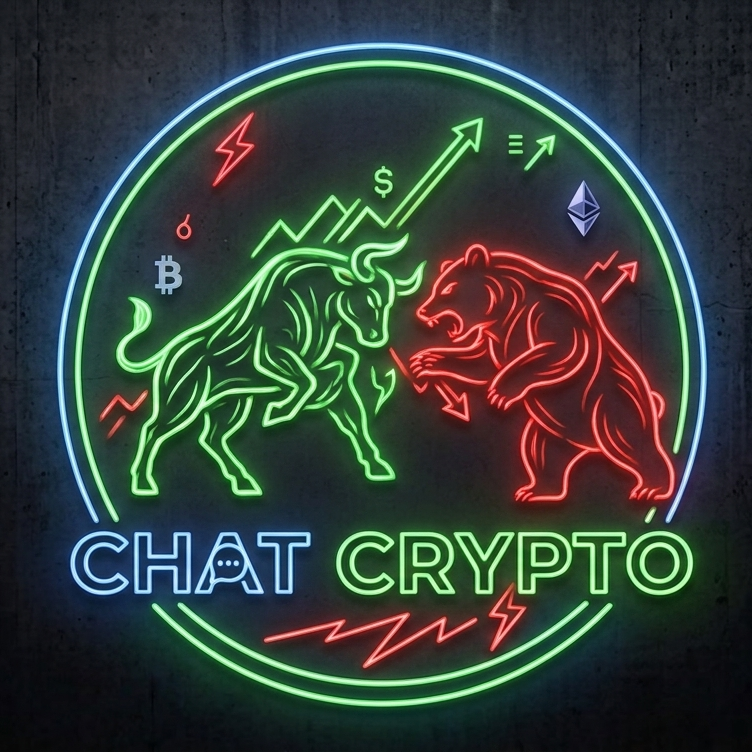

<p align="center">
  
  <br>
  <b>Chat Crypto Agent</b>
</p># Chat Crypto — Ամբողջական Telegram Mini App

AI-ով աշխատող կրիպտո-վերլուծական Telegram Mini App՝ Gemini API-ի (5 խելացի function-calling ֆունկցիա) և Binance-ի իրական տվյալների հիման վրա։

---

## 📁 Folder Structure

```
chatcrypto/
├── server.js            ← Backend (Express). AI ագենտի "ուղեղը" + Binance տվյալներ + (կամընտիր) bot-ի գործարկում
├── bot.js                ← Telegram Bot (@Chat_Crypto_Agent_Bot). Բացում է Mini App-ը
├── Dockerfile             ← Fly.io deploy-ի համար
├── fly.toml               ← Fly.io կարգավորումներ (միշտ-միացված, min_machines_running=1)
├── package.json          ← Node.js dependency-ների ցանկ
├── .env.example          ← Կարգավորումների նմուշ (պատճենիր որպես .env)
├── .env                  ← (դու ես ստեղծում) Իրական գաղտնի բանալիներ — ԵՐԲԵՔ մի՛ share արա
├── README.md              ← Այս ֆայլը
└── public/
    ├── index.html         ← Frontend (Mini App-ի ամբողջ UI՝ HTML+CSS+JS մեկ ֆայլում)
    └── assets/
        └── chat-crypto-logo.png  ← Chat Crypto-ի լոգոն
```

### Ինչու է կառուցվածքն այսպես

| Ֆայլ | Դեր | Ինչու է առանձին |
|---|---|---|
| `server.js` | AI logic, Binance API, HTTP endpoint-ներ | Սա այն «worker»-ն է, որին Telegram-ը/browser-ը իրականում խոսում է |
| `bot.js` | Telegram-ի հետ խոսակցություն (polling) | Առանձին process է, քանի որ Telegram-ի bot API-ն և web server-ը տարբեր life-cycle ունեն |
| `public/index.html` | Ինտերֆեյս | `server.js`-ը այն սպասարկում է որպես static ֆայլ browser/Telegram WebView-ի համար |
| `.env` | Գաղտնիքներ | Երբեք չի commit-վում Git-ում, պահվում է միայն քո սերվերի վրա |

---

## ⚙️ Ինչպես աշխատում է ամբողջությամբ

```
Օգտատեր Telegram-ում
   │
   │ 1) գրում է /start բոտին
   ▼
bot.js (@Chat_Crypto_Agent_Bot)
   │
   │ 2) ցույց է տալիս "🚀 Բացել Chat Crypto" WebApp կոճակը
   ▼
Օգտատերը սեղմում է կոճակը
   │
   │ 3) Telegram-ը բացում է MINI_APP_URL-ը (webview-ի ներսում)
   ▼
public/index.html (server.js-ից սպասարկվող)
   │
   │ 4) օգտատերը գրում է հարց ("BTC-ն կաճի՞")
   ▼
POST /api/chat → server.js
   │
   │ 5) server.js-ը կանչում է Gemini API-ին (tool-calling)
   │    Gemini-ն ինքն է որոշում՝ պետք է analyze_coin կանչել
   ▼
server.js-ը կանչում է Binance API (իրական գներ/klines)
   │
   │ 6) տվյալները վերադառնում են Gemini-ին, Gemini-ն կազմում է վերջնական պատասխանը
   ▼
Պատասխանը վերադառնում է օգտատիրոջը՝ ընտրված լեզվով
```

---

## 🚀 Տեղադրում քայլ առ քայլ

### 1. Բանալիներ ստանալ

- **Gemini API key** → https://aistudio.google.com/app/apikey
- **Telegram Bot token** → @BotFather-ում `/mybots` → ընտրիր բոտը → **API Token** → **Revoke current token**-ով նոր token ստացիր (հին token-ը այլևս վավեր չէ)

### 2. `.env` ֆայլի ստեղծում

```bash
cp .env.example .env
```

Բացիր `.env`-ը և լրացրու.
```
GEMINI_API_KEY=AIzaSy...        ← քո իրական բանալին
TELEGRAM_BOT_TOKEN=...              ← BotFather-ից ստացած ՆՈՐ token-ը
MINI_APP_URL=https://...            ← deploy-ից հետո ստացած https հասցեն (քայլ 4-ից)
```

### 3. Dependency-ների տեղադրում

```bash
npm install
```

### 4. Backend-ի deploy

Երկու տարբերակ կա.

**A) Fly.io (խորհուրդ է տրվում՝ անվճար + երբեք չի քնում)**

```bash
# 1) Տեղադրիր flyctl
curl -L https://fly.io/install.sh | sh

# 2) Մուտք գործիր/գրանցվիր
fly auth login

# 3) Նախագծի folder-ում գործարկիր (fly.toml-ը արդեն պատրաստ է)
cd chatcrypto
fly launch --no-deploy   # ընտրիր անուն, հաստատիր region-ը (fra = Frankfurt)

# 4) Գաղտնիքները ավելացրու (GEMINI_API_KEY, TELEGRAM_BOT_TOKEN, MINI_APP_URL)
fly secrets set GEMINI_API_KEY=AIzaSy... TELEGRAM_BOT_TOKEN=... MINI_APP_URL=https://chat-crypto.fly.dev FUTURES_CALCULATOR_URL=https://t.me/Block_News_Crypto_bot

# 5) Deploy
fly deploy
```

`fly.toml`-ում արդեն կարգավորված է `min_machines_running = 1` — սա նշանակում է backend-ը (և դրա ներսում աշխատող Telegram bot-ը) **երբեք չի «քնում»**, Free Allowance-ի սահմաններում մնալով։

> Backend-ը (`server.js`) և Telegram bot-ը (`bot.js`) **միասին, մեկ պրոցեսում** են աշխատում. `server.js`-ը startup-ի ժամանակ ինքն է ներբեռնում bot.js-ի `startBot()`-ը, եթե `TELEGRAM_BOT_TOKEN` և `MINI_APP_URL` կարգավորված են։ Առանձին deploy անելու կարիք չկա bot-ի համար։

**B) Render/Railway/VPS** (այլընտրանք)

Deploy արա `server.js`-ը՝ `npm start` start command-ով, `npm install` build command-ով։ Deploy-ից հետո ստացած https հասցեն գրիր `.env`-ի `MINI_APP_URL`-ի մեջ։

> `server.js`-ը ինքնաբավ է. եթե `public/index.html`-ը բացակայում է hosting-ի վրա, backend-ն ինքն է այն ստեղծում գործարկման պահին (embedded կոպիայից)։

### 5. Bot-ի գործարկում

Եթե backend-ը deploy արել ես Fly.io-ով (քայլ 4A) — **բոտն արդեն ինքն է գործարկվում** backend-ի հետ միասին, առանձին ոչինչ պետք չէ անել։

Եթե ուզում ես բոտը որպես **առանձին** process գործարկել (local dev-ի ժամանակ, կամ Render/Railway-ում որպես 2-րդ service).
```bash
npm run bot
```

### 6. BotFather-ում Mini App-ի կապակցում (կամընտիր, բայց խորհուրդ է տրվում)

`/mybots` → ընտրիր բոտը → **Bot Settings** → **Menu Button** → **Configure Menu Button** → տուր `MINI_APP_URL`-ը։ Այսպես Mini App-ը կերևա նաև bot-ի chat պատուհանի ներքևի ձախ կոճակի տեղում։

---

## 🧠 Ագենտի 5 խելացի ֆունկցիաները

| Ֆունկցիա | Ինչ է անում |
|---|---|
| `analyze_coin` | RSI(14), SMA20/50, տրենդի ազդանշան՝ Binance klines-ից |
| `risk_calculator` | Leverage-ով liquidation գին, ռիսկի հեռավորություն, առաջարկվող position size |
| `market_overview` | Top 5 gainers/losers, market breadth |
| `compare_coins` | Երկու coin-ի կողք-կողքի տեխնիկական համեմատություն |
| `portfolio_simulator` | Հիպոթետիկ գործարքի PnL հաշվարկ |

---

## 🔒 Անվտանգության կանոններ

1. `.env` ֆայլը **երբեք** մի՛ push արա GitHub-ում (ավելացրու `.gitignore`-ում)։
2. Եթե token/key-ը պատահաբար հրապարակվեց (chat-ում, screenshot-ում, GitHub-ում), անմիջապես **revoke** արա (BotFather-ում՝ `/revoke`, Google AI Studio-ում՝ delete key) և ստացիր նոր։
3. `TELEGRAM_BOT_TOKEN`-ը և `GEMINI_API_KEY`-ը գաղտնիքներ են՝ հավասար նշանակությամբ ինչպես բանկային գաղտնաբառը։

---

## 🛠️ Troubleshooting

| Սխալ | Պատճառ | Լուծում |
|---|---|---|
| `Cannot GET /` | Static path սխալ | Արդեն ուղղված է (`__dirname` + fallback route) |
| `index.html չի գտնվել` | `public/` folder-ը deploy-ի ժամանակ բացակայել է | Ինքնաբերաբար ստեղծվում է (embedded fallback) |
| «Կապ չհաջողվեց» + `[Debug: ...]` | Սովորաբար `GEMINI_API_KEY` սխալ/բացակա | Ստուգիր `.env`-ը, վերագործարկիր server-ը |
| Bot-ը չի արձագանքում | `TELEGRAM_BOT_TOKEN` սխալ կամ `bot.js` չգործարկված | `npm run bot`, ստուգիր console output-ը |
| WebApp կոճակը չի բացվում | `MINI_APP_URL`-ը http է, ոչ https | Telegram WebApp-ը պահանջում է **https** |
